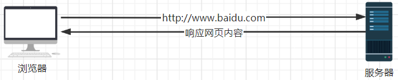
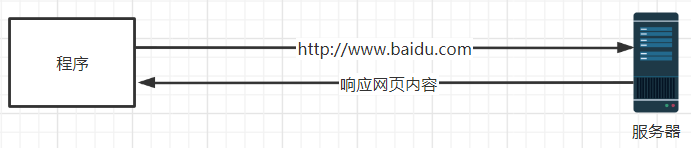
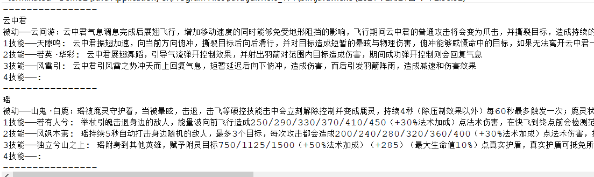
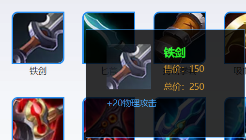

# 第1课—爬虫初识

## 1. 什么是爬虫？

爬虫是一种网络机器人，用于按照一定规则爬取网络上的信息。爬虫是一种学习兴趣爱好。

## 2. 爬虫的应用场景

1. 抢票软件
2. 搜索引擎（百度搜索等）
3. 舆论分析
4. 英汉互译
5. 各类下载器
6. 活动一键领取

## 3. 爬虫的原理

1. **网页原理**

通过浏览器访问服务器上的资源，服务器响应网页内容给浏览器，浏览器渲染显示。

   

2. **爬虫原理**

通过程序/代码的方式访问服务器上的资源，并对响应的内容进行自定义处理。

 

## 4. Java实现爬虫的技术

- HttpUrlConnection（Java原生，使用复杂）
- HttpClient（Apache出口，版本混乱）
- **Jsoup**（第三方开源的工具包，简单便捷，推荐使用）

## 5. 爬取王者荣耀英雄信息

### 5.1 Jsoup常用api

#### 5.1.1 发送请求

```java
//请送get请求，并将结果转为Docment对象（处理文本）
Document document = Jsoup.connect("url").get();

//发送post请求，并将结果转为Docment对象（处理文本）
Document document = Jsoup.connect("url").post();

//发送请求，并将结果转为response对象（处理文件）
Response response = Jsoup.connect(url).execute();

//如果要忽略内容类型，则使用ignoreContentType(true)
Jsoup.connect(url).ignoreContentType(true).execute()
```

#### 5.1.2 Docment常用api

```java
//在docment中查找class名叫herolist的标签集合
document.getElementsByClass("herolist")
    
//在docment中查找标签名叫a的标签集合
Elements elements = docment.getElementsByTag("a")
    
//获取标签的文本信息
docment.text();    
```

#### 5.1.3 Response常用api

```java
//将结果转为文本
response.body();

//将结果转为byte[]
response.bodyAsBytes()
```

### 5.2 爬取王者荣耀英雄资料


## 6. 作业

1、爬取王者荣耀英雄的全部技能信息，并输出如下格式：

 

2、爬取王者荣耀局内道具信息（如下所示），并将信息输出在控制台

 