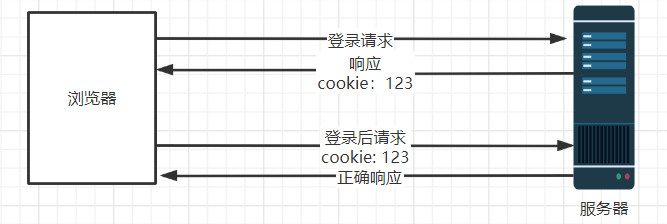
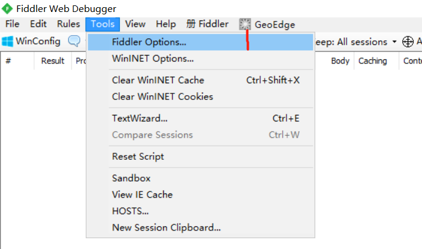
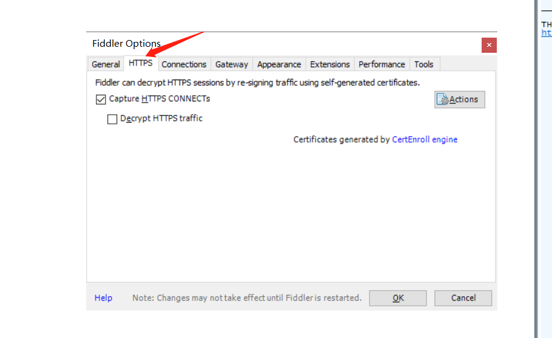
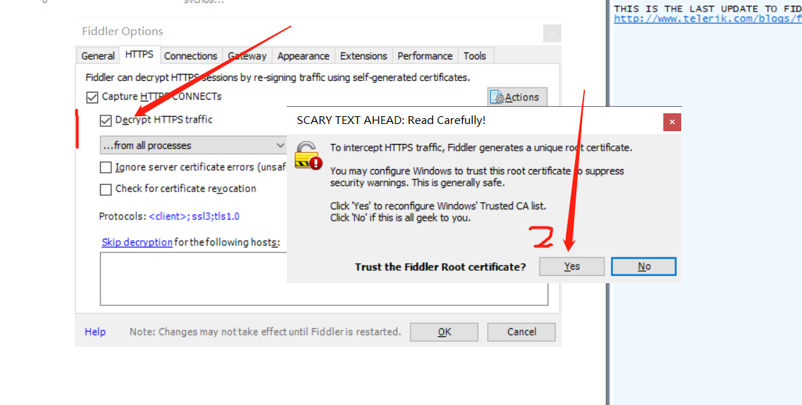
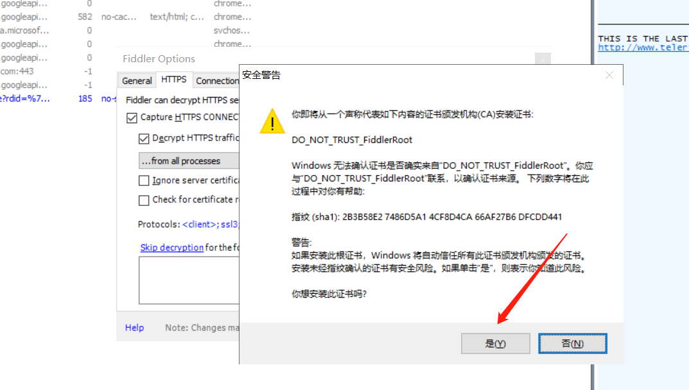
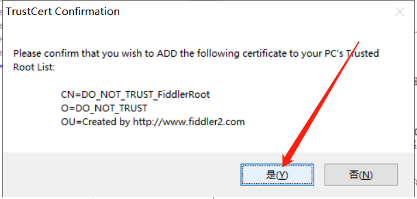
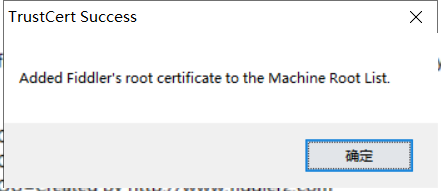
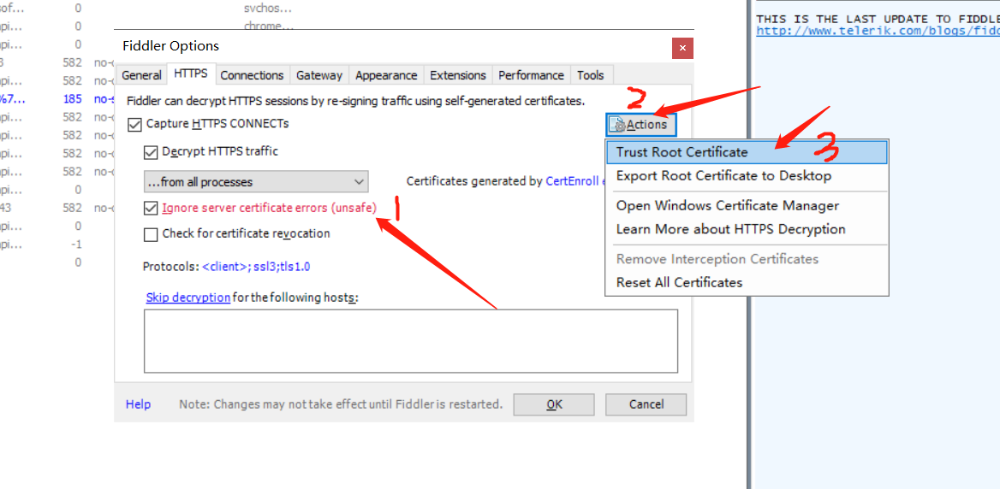
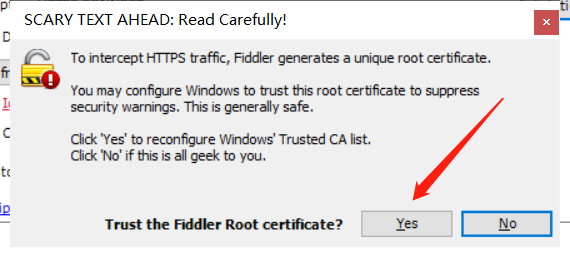

# 第2课—爬虫过登录认证

## 学习目标

- 掌握爬虫过登录技巧（豆瓣网为例）

## 1. 目前所面临的问题

- 有些网站是需要登录后才能爬取到相关数据的，如何解决呢？

## 2. 问题分析

- 登录认证原理分析

 

- 解决思路

把cookie保存起来，并在后面的请求中带上原来的cookie

## 3. 爬虫登录豆瓣网

### 3.1 专业分析工具Fiddler

Fiddler是一个专业的Http协议分析工具，我们将使用它来获取豆瓣网的数据。但是Fiddler默认是不支持Https协议的，因此我们需要先进行相关配置。

#### 3.1.1 配置Fiddler支持Https

 

 

 

 

 

 

 

 

如果再次出现，同上面截图一样配置即可。

### 3.2 Jsoup的高级api

#### 3.2.1 使用execute发送post请求

```java
Map<String, String> data = new HashMap<>();
data.put("key1", "value1");
data.put("key2", "value2");
		
response = Jsoup.connect("请求链接")
    .method(Method.POST)		//设置为post请求
    .ignoreContentType(true)	//忽略内容类型错误
    .data(data)					//请求的参数
    .cookies(cookies)			//cookie
    .execute();					
```

#### 3.2.2 将字符串转为Docment对象

```java
//将字符串xxxx转为Docment对象，方便进行过滤
Document document = Jsoup.parse("xxxx");
```

#### 3.2.3 清空Map中的数据

```java
map.clear();	//清空map中原来的数据
```

#### 3.2.4 两个map内容合并

```java
map.putAll(map2);	//将map2的内容添加到map中
```


